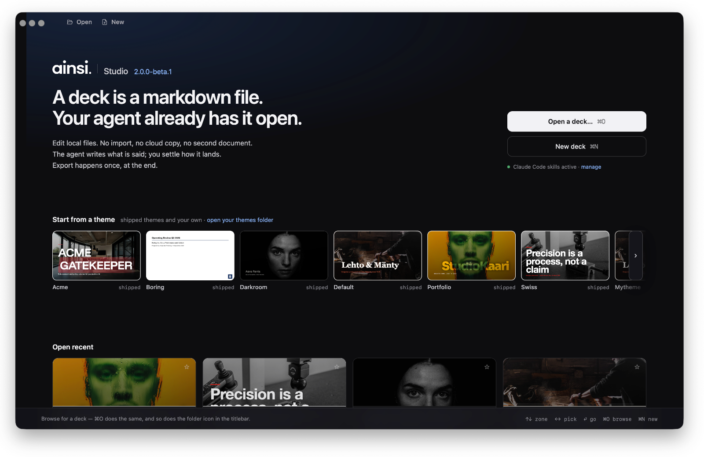
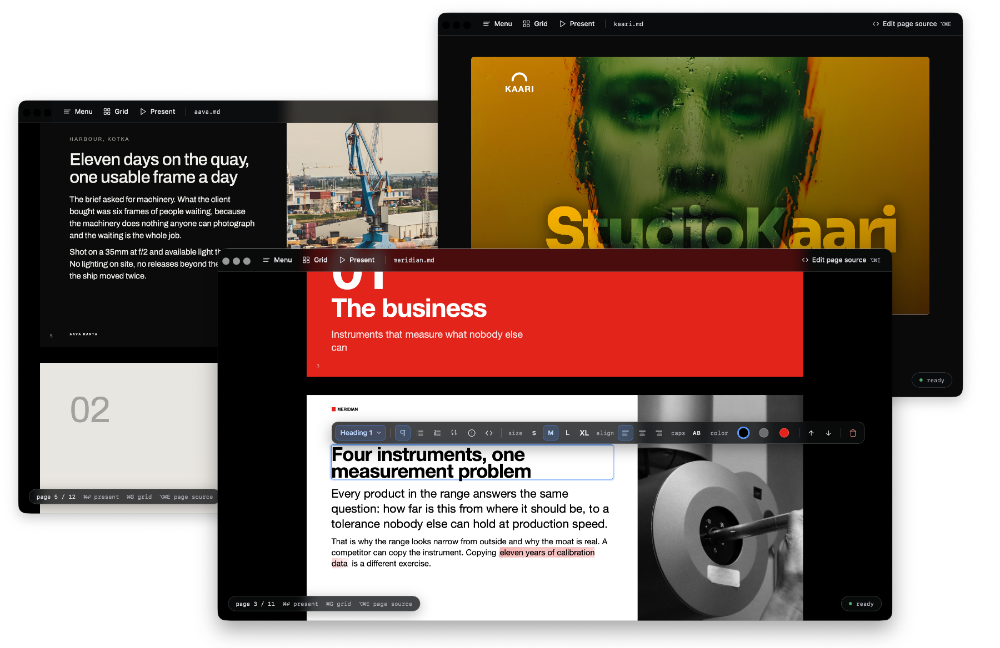
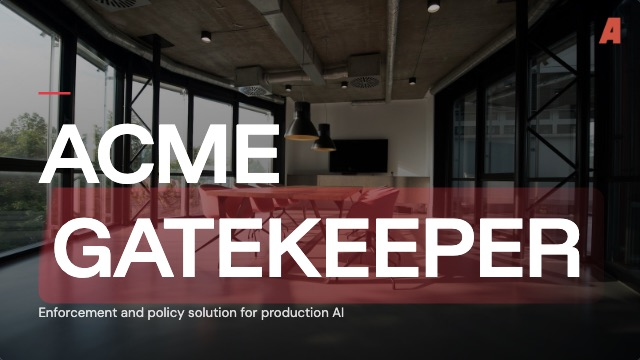
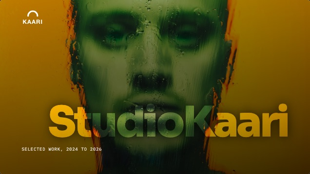
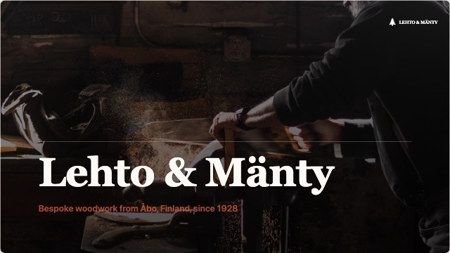
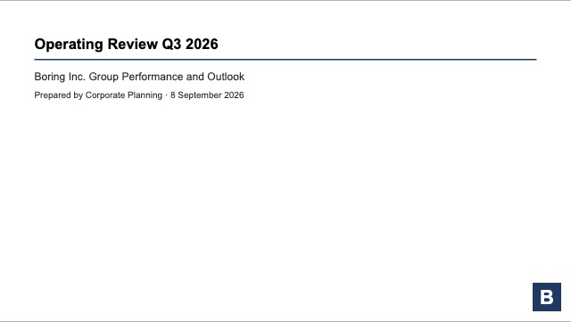
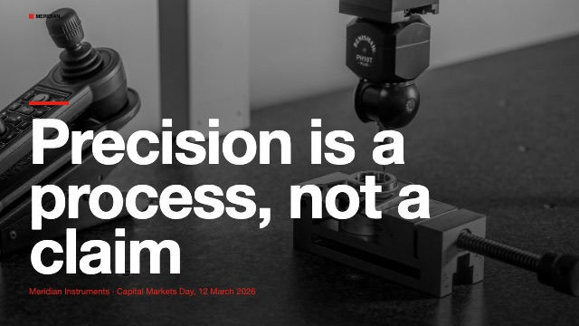
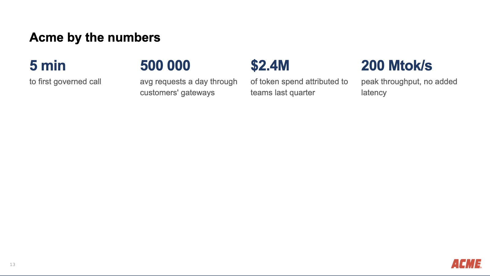
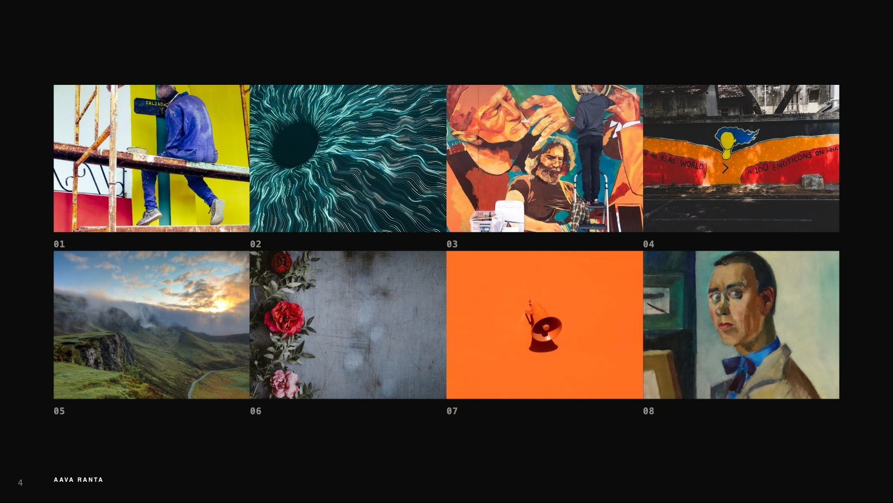

# Ainsi

Presentations as local markdown files. Everything runs on your machine. There is no service and no account.

**Ainsi Studio** is where the deck is written: you and your own local AI agent, Claude Code or Cowork, editing the same file. **Ainsi Stage** is the standalone HTML player it exports: one file, shown anywhere. The final step is export to PDF or **editable PPTX**.

## Demo: Ainsi Stage

Six decks, six themes, each built from the markdown beside it and exported as Stage. They open in the browser: ⌘⏎ presents, ⌘G is the grid, and the same file reads as a document on a phone.

<table>
<tr>
<td width="33%" align="center"> <a href="https://mikkokam.github.io/ainsi/samples/gatekeeper/gatekeeper.html"><b>Acme Gatekeeper</b></a> <code>acme</code> · <a href="samples/gatekeeper/gatekeeper.md">source</a></td>
<td width="33%" align="center"> <a href="https://mikkokam.github.io/ainsi/samples/kaari/kaari.html"><b>Studio Kaari</b></a> <code>portfolio</code> · <a href="samples/kaari/kaari.md">source</a></td>
<td width="33%" align="center"> <a href="https://mikkokam.github.io/ainsi/samples/lehto/lehto.html"><b>Lehto &amp; M&auml;nty</b></a> <code>default</code> · <a href="samples/lehto/lehto.md">source</a></td>
</tr>
<tr>
<td width="33%" align="center"> <a href="https://mikkokam.github.io/ainsi/samples/boring-inc/boring-inc.html"><b>Boring Inc.</b></a> <code>boring</code> · <a href="samples/boring-inc/boring-inc.md">source</a></td>
<td width="33%" align="center"> <a href="https://mikkokam.github.io/ainsi/samples/aava/aava.html"><b>Aava Ranta</b></a> <code>darkroom</code> · <a href="samples/aava/aava.md">source</a></td>
<td width="33%" align="center"> <a href="https://mikkokam.github.io/ainsi/samples/meridian/meridian.html"><b>Meridian Instruments</b></a> <code>swiss</code> · <a href="samples/meridian/meridian.md">source</a></td>
</tr>
</table>

A product pitch, a design studio's selected work, a furniture workshop, a quarterly operating review, a photographer's portfolio and a capital markets day. Acme Gatekeeper is the one to read first: seventeen pages and most of the components.

## Install

Ainsi comes in two forms, a desktop app and a CLI with the same Studio served to your browser. Both are local. This is version two, currently in beta.

### Desktop app (macOS, Apple Silicon)

Download the latest `.dmg` from the [releases page](https://github.com/mikkokam/ainsi/releases/latest). The app checks for its own update at launch and offers it in Studio and in the app menu.

**Beta: the build is not signed or notarised yet.** Gatekeeper refuses it outright: a first double-click says the app is damaged and offers nothing but Trash. For the daring, after dragging it to Applications:

    xattr -cr /Applications/Ainsi.app

That clears the quarantine flag macOS set on the download, and the app opens normally from then on. Without a terminal: open System Settings → Privacy & Security, scroll to the bottom, and there is an Open Anyway button for Ainsi, but only after a first attempt at opening it has failed and left one there.

The other way around it: build it yourself. A file you build locally never gets the quarantine flag in the first place, since that is only set on something macOS watched arrive from outside (a download, an AirDrop, a browser). Requires [Bun](https://bun.sh) and Xcode's Command Line Tools (`xcode-select --install`; the full Xcode app is not needed):

    git clone https://github.com/mikkokam/ainsi.git
    cd ainsi
    bun install
    bun run app:build

The app lands in `desktop/electrobun/build/stable-macos-arm64/Ainsi.app` and opens straight away.

Not in the mood for any of that: skip the app entirely and run the [CLI](#cli) below instead. Same Studio, in your browser, and it needs nothing but Bun.

### CLI

Requires [Bun](https://bun.sh).

    git clone https://github.com/mikkokam/ainsi.git
    cd ainsi
    bun install --production
    bun link                          # puts `ainsi` on the PATH, globally

`--fit`, PDF export and PPTX export measure pages in a headless browser. `--production` leaves that browser out; [Install](docs/guide/install.md) says how to add one or point Ainsi at a browser already on the machine. Without one a build still writes a file, unfitted, and says so.

### Docker

For running the CLI's studio server on Linux, or reaching it from a browser on another machine:

    git clone https://github.com/mikkokam/ainsi.git
    cd ainsi
    docker build -t ainsi .
    docker run -d -t -p 4321:4321 --memory 6g ainsi

Point a browser at the host's port 4321. There is no published image yet; the `Dockerfile` builds Chromium in, which is why the image is not small.

The studio and the stage are lean. PPTX export of a very large deck is not: the headless browser holds the whole deck rendered at 2x while the pages are shot, and 120 pages with a full-bleed photograph on each peaked at 4.5 GB. `--memory` caps the container, and Docker Desktop's own VM (Settings, Resources, Memory) caps every container beneath it, at 2 GB on older installs; raise that first or the export is killed with nothing to show for it.

## Use

    ainsi deck.md                     # opens Studio on the deck
    ainsi                             # opens Studio on the chooser
    ainsi build deck.md               # writes deck.html, a Stage, and exits
    ainsi build deck.md --to pdf      # deck.pdf, fitted, one sheet per page
    ainsi build deck.md --to pptx     # deck.pptx, editable text boxes over a raster ground
    ainsi --help                      # every command and flag

Studio is where you click a block to change what it is, edit the text, try a theme, and export. Presenting is ⌘⏎, in Studio and in a Stage alike. Every flag is in [the CLI](docs/guide/cli.md), every gesture in [Studio](docs/guide/studio.md).

`samples/gatekeeper/gatekeeper.md` is a full deck to start from.

## In Claude Code

    claude plugin marketplace add mikkokam/ainsi
    claude plugin install ainsi@ainsi

Claude Code is the first-class client. The plugin's skill teaches the agent the grammar and the build loop, so it produces a deck in the house look and argues with you about the content instead of the formatting. It calls the `ainsi` on your PATH, so install the tool first. [Claude Code](docs/guide/claude-code.md) has the rest.

## Authoring

The loop: write `deck.md` with your agent in a folder on your machine, run `ainsi deck.md`, and a browser opens on the deck. Everything either of you does from then on lands in that one file. The agent rewrites a page while you are looking at it and the view reloads; you retype a line in Studio and the agent's next read sees it. There is no second copy of the document, so there is no split brain, nothing to sync and nothing to import. The same file opens in any markdown editor, and goes to anyone who has never heard of this tool.

The last mile is visual, so there is **Ainsi Studio**: a desktop view over the same file, where you right click a block and change what it is, edit the text, try another theme. The agent writes what is said, you settle how it lands, and neither of you leaves the `.md`.

**Flow.** Add `---` to split a page. Optional `--fit` flows pages automatically: too much on a slide and the solver steps the type down within the range the theme allows, then splits at the natural seam. When it cannot fit, it tells you instead of quietly cropping.

    <!-- ainsi: timeline axis=horizontal -->     a run of blocks
    <!-- ainsi:layout header align=center -->    the page it sits on

## Export

When the deck has to leave your machine it leaves as a result, not as a project: **Ainsi Stage**, one self-contained HTML page with the images embedded, which presents full-screen, prints and fits the screen on a phone. The final step, when someone needs a document rather than a deck, is a **PDF** or an **editable PPTX** for whoever wants to carry on in PowerPoint (poor them). The deck stays a `.md` file with an `.html` file beside it as an export, not the source.

## What a page can be

Fourteen components, each a markdown list or table with a comment naming it, so the source stays readable as text: `agenda`, `alert`, `bar-table`, `boxes`, `columns`, `comparison`, `figures`, `full`, `matrix`, `prose`, `roadmap`, `striped-table`, `tiles`, `timeline`. A component decides how a run of blocks reads, never what colour it is. [What each one takes](docs/guide/components.md).

Four layouts decide the page around them: `default`, `header` for a title or a photo ground, `section` for a divider, `split` for text beside an image. [Themes add their own](docs/guide/themes.md#layouts).

A theme decides the look, and a theme is a folder. Swapping it rebrands every deck you have ever written, untouched. One page of `samples/gatekeeper/gatekeeper.md`, unchanged, under two of the themes in this repo:

The figures are not merely recoloured: `boring` lowers `--ainsi-figures-max`, the cap the figures component sets its own display size against, so a figure reads as a number in a sentence rather than a headline. That is the whole of a theme's reach into a component. A theme may set the tokens a component publishes and it may style the page around it, but it may not select into its markup, and the build warns when a stylesheet tries.

The same component under a theme that asked for the opposite: `crop` trims every picture to one cell, and the theme's own layout takes the gutter to zero, so the field reads as a contact sheet rather than an index.

## What this is instead of

**A hosted AI deck tool.** You pay, and the deck lives in their cloud. Your agent cannot open it, so the work splits in two: the thinking happens in your repo and the artefact happens in a browser tab, and the two diverge from the first edit. Export is a one-way door out of a place your tools could not reach anyway.

**PowerPoint.** A deck here is a few kilobytes of what you actually say. The same deck as a `.pptx` is a zip of XML in which the words are a small fraction of the bytes, the rest spacing, run properties and theme parts. An agent asked to edit one converts in, converts out, and spends its context on how a bullet is indented, which is time, tokens and attention not spent on the argument the deck was for. Keeping the deck in markdown keeps the context tight. You still get a `.pptx` here, at the end, for whoever wants one.

**Marp, Slidev, reveal.js.** The nearest neighbours: markdown or HTML decks, local files, version control, no service. The differences are narrow and worth naming.

| | editing surface | PPTX out | a page that overflows |
| --- | --- | --- | --- |
| Marp | preview pane | slides as images; editable text is an experimental option | manual |
| Slidev | dev server, editor pane | slides as images | manual |
| reveal.js | none | none | manual |
| ainsi | Studio: click a block, change what it is | text stays text | measured, stepped down, then split |

The last column is the one that decides how a deck is written. Everywhere else, fitting is manual: you write, you look, you cut, you look again. Here the solver measures the real page and steps the type down within the range the theme allows before splitting at a seam, and says so when it cannot. The PPTX column is the other: exporting slides as pictures is a handoff nobody can continue, and text boxes over a rendered ground is one they can.

## The guide

[docs](docs/README.md) is the reference: [writing a deck](docs/guide/writing.md), [components](docs/guide/components.md), [layouts](docs/guide/layouts.md), [frontmatter](docs/guide/frontmatter.md), [themes](docs/guide/themes.md). `docs/ARCHITECTURE.md` is how it is built. `docs/FEATS.md` is what is not built.

## Development

    bun install                       # the full tree, browser wrapper included
    bun test
    bun run dev samples/aava/aava.md  # Studio in a browser, hot
    bun run app                       # the desktop app, built and launched
    bun run app:build                 # the same app as a .app and a .dmg

The core is plain TypeScript with no framework: one engine (parse, paginate, group, fit, render) and three consumers of it, the CLI, the Stage player shipped inside every exported deck, and Studio served by the dev server. A theme is a token list under `themes/`, a component under `src/components/` ships its own CSS against those tokens, and the engine owns the page box.

`dev` runs Studio under `bun --watch`. A deck edit and an edit to Studio's own css or script push a reload to the open page; an edit to the engine restarts the process, and the page reloads when it reconnects and finds the build has moved. Studio prints each rebuild's milliseconds by phase; `localStorage.setItem("ainsi:trace", "1")` reports every commit round trip and `AINSI_TRACE=1` adds the server's side of the write.

A release is `bun run app:build`, then the update manifest (`stable-macos-arm64-update.json`) and the `.app.tar.zst` it wrote into `desktop/electrobun/artifacts/` uploaded as release assets, with the `.dmg` for a first install. An installed app reads that manifest from the latest release; a dev build reports updates as disabled.

## Licence

MIT, see [LICENSE](LICENSE). Mikko Kämäräinen, mikko@ukk0.com.

The photographs in the sample decks are from [Unsplash](https://unsplash.com), used under the Unsplash Licence; each photo's id is in its url. The marks in them belong to invented companies.
