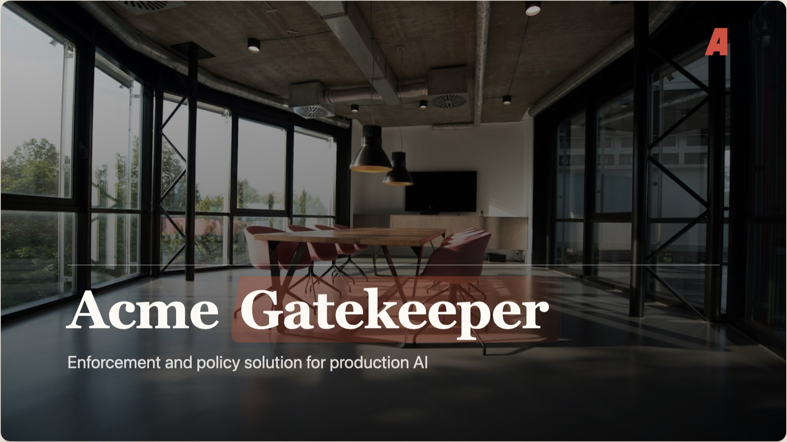
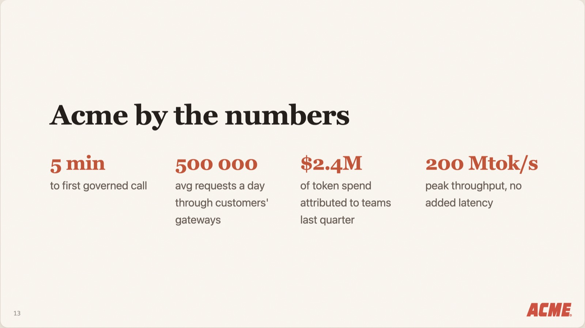
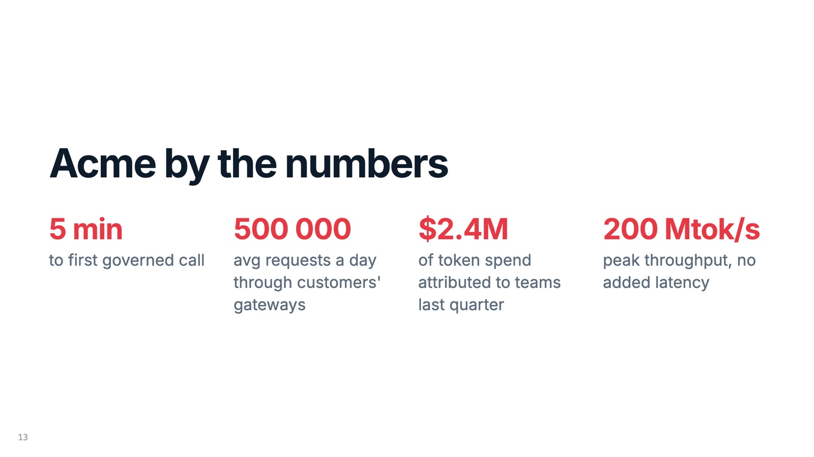
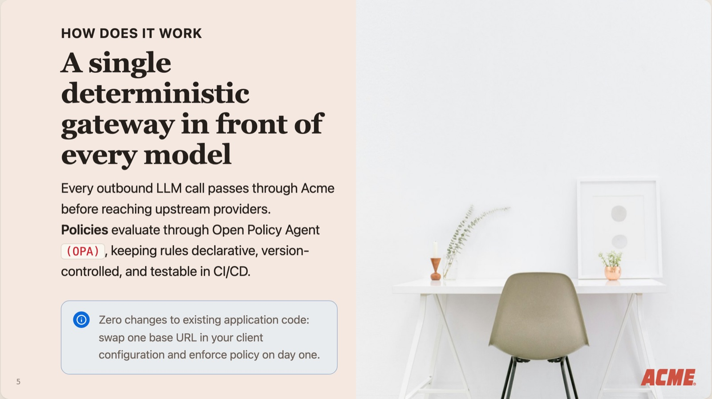
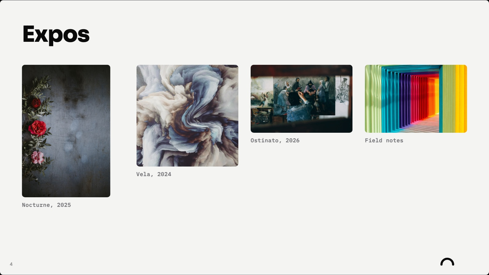

# Ainsi

Presentations in markdown, for agent-first work on local files, with a GUI for the last mile.

## Demo

Three decks, three themes, each built from the markdown beside it. They open in the browser: ⌘⏎ presents, ⌘G is the grid, and the same file reads as a document on a phone.

- **[Acme Gatekeeper](https://mikkokam.github.io/ainsi/samples/acme/acme.html)**, the `acme` theme: a product pitch, seventeen pages, most of the components. [Source](samples/acme/acme.md).
- **[Studio Kaari](https://mikkokam.github.io/ainsi/samples/portfolio/portfolio.html)**, the `portfolio` theme: a work portfolio, pictures at their own proportions. [Source](samples/portfolio/portfolio.md).
- **[Winter service review](https://mikkokam.github.io/ainsi/samples/review/review.html)**, the `default` theme: a review with no photographs at all, tables and figures carrying it. [Source](samples/review/review.md).

The loop: write `deck.md` with your agent in a folder on your machine, run `ainsi deck.md`, and a browser opens on the deck. Everything either of you does from then on lands in that one file. The agent rewrites a page while you are looking at it and the view reloads; you retype a line in the studio and the agent's next read sees it. There is no second copy of the document, so there is no split brain, nothing to sync and nothing to import. The same file opens in any markdown editor, and goes to anyone who has never heard of this tool.

That is the case for markdown over a slide format. A deck here is a few kilobytes of what you actually say. The same deck as a `.pptx` is a zip of XML in which the words are a small fraction of the bytes, the rest spacing, run properties and theme parts, so an agent asked to edit one spends its context on how a bullet is indented and loses the thread of the argument you needed the deck to make. Keeping the deck in markdown keeps the context tight and the attention, yours and the agent's, on what is said.

When the deck has to leave your machine it leaves as a result, not as a project: one self-contained HTML page with the images embedded, which presents full-screen, prints and reads as a document on a phone; or a PDF; or an editable PPTX for whoever wants to carry on in PowerPoint. Nothing runs but your machine, there is no service and no account, and the deck stays a `.md` file with an `.html` file beside it.

The markdown says what a block is (a timeline, a comparison) and what shape a page takes, never what either looks like. A theme decides that, and a theme is a folder. Swapping it rebrands every deck you have ever written, untouched. One page of `samples/acme/acme.md`, unchanged, under two of the themes in this repo:

Pages are computed, not authored. Too much on a slide and the solver steps the type down within the range the theme allows, then splits at the natural seam. When it genuinely cannot fit, it tells you instead of quietly cropping.

    <!-- ainsi: timeline axis=horizontal -->     a run of blocks
    <!-- ainsi:layout header align=center -->    the page it sits on

The last mile is visual, so there is a studio: a browser page over the same file, where you click a block and change what it is, edit the text, try another theme. The agent writes what is said, you settle how it lands, and neither of you leaves the `.md`.

Claude Code is the first-class client. The repo ships as a plugin whose skill teaches the grammar and the build loop, so the agent produces a deck in the house look and argues with you about the content instead of the formatting.

Version 1.0.

## What this is instead of

**A hosted AI deck tool.** You pay, and the deck lives in their cloud. Your agent cannot open it, so the work splits in two: the thinking happens in your repo and the artefact happens in a browser tab, and the two diverge from the first edit. Export is a one-way door out of a place your tools could not reach anyway.

**PowerPoint.** The format is a zip of XML in which your words are a small fraction of the bytes. An agent asked to edit one converts in, converts out, and spends its context on run properties and spacing, which is time, tokens, and attention not spent on the argument. You still get a `.pptx` here, at the end, for whoever wants one.

**Marp, Slidev, reveal.js.** The nearest neighbours: markdown or HTML decks, local files, version control, no service. The differences are narrow and worth naming, and the following is from memory rather than from their docs today, so check before quoting it.

| | editing surface | PPTX out | a page that overflows |
| --- | --- | --- | --- |
| Marp | preview pane | slides as images | your problem |
| Slidev | dev server, editor pane | slides as images | your problem |
| reveal.js | none | none | your problem |
| ainsi | studio: click a block, change what it is | text stays text | measured, stepped down, then split |

The last column is the one that decides how a deck is written. Everywhere else, fitting is manual: you write, you look, you cut, you look again. Here the solver measures the real page and steps the type down within the range the theme allows before splitting at a seam, and says so when it cannot. The PPTX column is the other: exporting slides as pictures is a handoff nobody can continue, and text boxes over a rendered ground is one they can.

## Install

Requires [Bun](https://bun.sh).

    git clone git@github.com:mikkokam/ainsi.git
    cd ainsi
    bun install --production
    bun link                          # puts `ainsi` on the PATH, globally

`--fit`, PDF and PPTX measure in a headless browser, which `--production` leaves out; [Install](docs/guide/install.md) says how to give them one, and what a build does without it.

## Use

    ainsi deck.md                     # opens the studio on the deck
    ainsi                             # opens the studio on the chooser
    ainsi build deck.md               # writes deck.html and exits
    ainsi build deck.md --to pdf      # deck.pdf, fitted, one sheet per page

The studio is where you click a block to change what it is, edit the text, try a theme, and export. Presenting is ⌘⏎, in the studio and in a built deck alike. Every flag is in [the CLI](docs/guide/cli.md), every gesture in [the studio](docs/guide/studio.md).

`samples/acme/acme.md` is a full deck to start from.

## In Claude Code

    claude plugin marketplace add mikkokam/ainsi
    claude plugin install ainsi@ainsi

The plugin's skill teaches the agent the grammar and the build loop, and calls the `ainsi` on your PATH, so install the tool first. [Claude Code](docs/guide/claude-code.md) has the rest.

Diagrams are the sibling repo, [ainsi-d2](https://github.com/mikkokam/ainsi-d2): house-style D2 with its own skill and an `ainsi-d2` command.

## What a page can be

Fourteen components, each a markdown list or table with a comment naming it, so the source stays readable as text: `agenda`, `alert`, `bar-table`, `boxes`, `columns`, `comparison`, `figures`, `full`, `matrix`, `prose`, `roadmap`, `striped-table`, `tiles`, `timeline`. A component decides how a run of blocks reads, never what colour it is. [What each one takes](docs/guide/components.md).

Four layouts decide the page around them: `default`, `header` for a title or a photo ground, `section` for a divider, `split` for text beside an image. [Themes add their own](docs/guide/themes.md#layouts).

## The guide

[docs/guide](docs/guide/README.md) is the reference: [writing a deck](docs/guide/writing.md), [components](docs/guide/components.md), [layouts](docs/guide/layouts.md), [frontmatter](docs/guide/frontmatter.md), [themes](docs/guide/themes.md).

## Development

    bun install                       # the full tree, browser wrapper included
    bun test

The studio prints each rebuild's milliseconds by phase, and the browser console reports any commit round trip over 600 ms: write, rebuild, reload. `localStorage.setItem("ainsi:trace", "1")` reports every one, and `AINSI_TRACE=1` adds the server's side of the write.

`docs/ARCHITECTURE.md` is how it is built. `docs/FEATS.md` is what is not built. The core is plain TypeScript with no framework: one engine (parse, paginate, group, fit, render) and three consumers of it, the CLI, the player shipped inside every deck, and the studio served by the dev server. A theme is a token list under `themes/`, a component under `src/components/` ships its own CSS against those tokens, and the engine owns the page box.

## Licence

MIT, see [LICENSE](LICENSE). Mikko Kämäräinen, mikko@ukk0.com.
