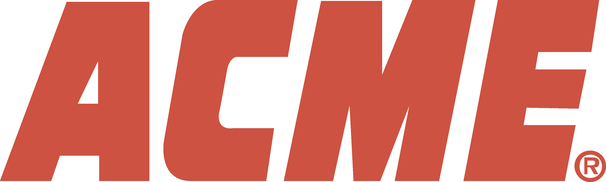

<!-- ainsi:layout header -->

# Acme ==Gatekeeper==

Enforcement and policy solution for production AI

<!-- ainsi: full size=full -->

---

<!-- ainsi: prose color=accent -->
# What we will cover

<!-- ainsi: agenda -->
1. **The problem** governance lags adoption in enforcement
2. **The gateway** one deterministic door in front of every model
3. **Proof** what a customer got in under an hour
4. **Roadmap and pricing** where this goes and what it costs

---

<!-- ainsi: layout split -->
# Fast-growing companies adopt AI faster than they can control it

 

A fifty-person ==engineering team== might now connect eight model <kbd>providers</kbd> across product, support, and `internal` tools - with zero unified audit trail, unpredictable monthly token invoices, and no automated compliance checks.

<!-- ainsi: full size=full -->

---

---

# What that costs them

<!-- ainsi: boxes -->
1. Customer audit failures when enterprise clients ask
2. Surprise token spikes discovered only at billing
3. Fragmented policies written in ad-hoc prompt code
4. Unchecked PII and secret leaks across ==shadow tools==

---

<!-- ainsi: prose size=small caps -->
<!-- ainsi: layout split side=right -->
How does it work

<!-- ainsi: prose size=small -->
# A single deterministic gateway in front of every model

Every outbound LLM call passes through Acme before reaching upstream providers.
**Policies** evaluate through Open Policy Agent `(OPA)`, keeping rules declarative, version-controlled, and testable in CI/CD.

> [!NOTE]
> Zero changes to existing application code: swap one base URL in your client configuration and enforce policy on day one.

<!-- ainsi: full align=right -->

---

# How Acme protects your workload

<!-- ainsi: columns -->
1. **Enforce** OPA inspects and validates requests before egress.
2. **Record** Immutable event stream of prompt hashes, latency, and tokens.
3. **Redact** Real-time PII masking and secret prevention at the wire.
4. **Comply** Instant audit packages for ISO 27001, SOC 2, and GDPR.

---

# Operating with & without Acme

<!-- ainsi: comparison -->
|                     | Today                    | With Acme                   |
| ------------------- | ------------------------ | --------------------------- |
| Audit trail         | Ad-hoc log queries       | Signed event stream (7 yrs) |
| Cost allocation     | Aggregate month-end bill | Per-team attribution, live  |
| Policy enforcement  | Confluence guidelines    | Declarative OPA bundles     |
| Provider onboarding | Weeks of security review | 15-minute credential update |
| Data residency      | Unknown routing          | Guaranteed EU-only egress   |

---

> When our enterprise bank clients asked for our AI data governance records, we delivered verified OPA enforcement logs in under an hour. Acme turned a potential sales blocker into our strongest trust proof.

<!-- ainsi: prose size=small align=right -->
VP of Engineering, Series B Fintech (Stockholm)

---

<!-- ainsi: prose color=soft -->
# Where Acme plays

<!-- ainsi: matrix x="effort to adopt" y="impact on risk" -->
- **Prompt guidelines** cheap, and nobody follows them
- **ACME: Gateway policy** one URL swap, every call governed
- **Manual audits** weeks of work per review
- **Model retraining** months, and the risk moves elsewhere

---

# Acme by the numbers

<!-- ainsi: figures -->
- **5 min** to first governed call
- **500 000** avg requests a day through customers' gateways
- **$2.4M** of token spend attributed to teams last quarter
- **200 Mtok/s** peak throughput, no added latency

---

# Product roadmap \ 2027

<!-- ainsi: timeline -->
- **Q1** Turnkey OPA policy bundles for basic compliance.
- **Q2** Real-time semantic budget limits and anomalous spend throttling.
- **Q3** Air-gapped on-premise appliances and self-hosted VPC agents.
- **Q4** Native zero-trust egress connectors for sovereign European LLMs.

---

# Transparent, usage-based pricing

| Tier       | Workspaces | Monthly Requests | Retention & Compliance | Price        |
| ---------- | ---------- | ---------------- | ---------------------- | ------------ |
| Team       | 3          | Up to 500k reqs  | 90-day signed logs     | 490 € / mo   |
| Business   | 10         | Up to 5M reqs    | 2-year audit vault     | 1 450 € / mo |
| Enterprise | Unlimited  | Custom volume    | 7-year vault + VPC     | Custom       |

---

<!-- ainsi: layout split -->
<!-- ainsi: prose size=small -->
# Built by infrastructure engineers

<!-- ainsi: full size=full align=right -->

<!-- ainsi: prose size=small -->
Founded by former payment security and distributed systems leads from More Inc and Bank of Tor. We built Acme after managing compliance across 400+ LLM services internally. Today, Acme governs production traffic across 18 European tech companies.

<!-- ainsi: columns -->
- **400+** LLM services governed internally before Acme
- **18** European tech companies in production today
- **EU** residency and egress by default

---

<!-- ainsi:layout header align=center -->

<!-- ainsi: prose align=center -->
# Start enforcing AI in production today

<!-- ainsi: prose size=small align=center -->
Get in touch for a 30-minute architecture review or deploy a self-hosted trial.

<!-- ainsi: full size=full -->

