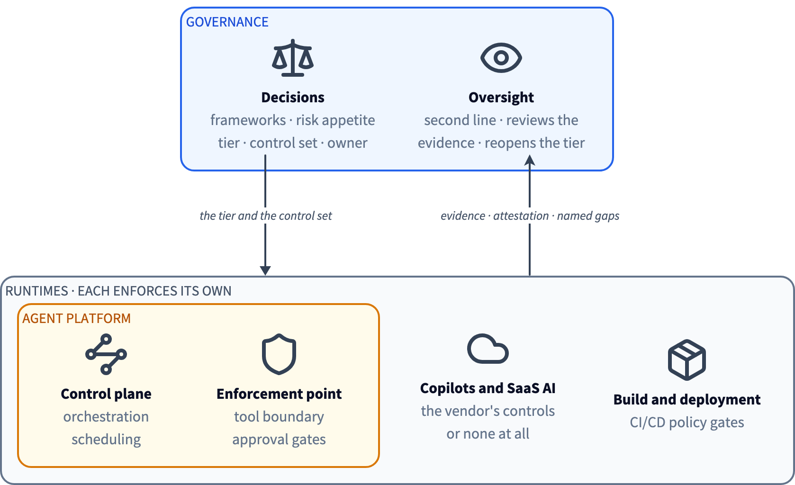

<!-- ainsi: prose size=small caps color=accent -->
<!-- ainsi: layout default tone=inverse -->
Governance and enforcement

# The systems being governed are in flux

<!-- ainsi: boxes stretch -->
1. **Models** Swapped for a newer version, a cheaper provider or a fine-tune, and every system built on the old one inherits the change.
2. **Agents & the platforms** Built on Foundry, Bedrock, Google or in-house orchestration, acting on business systems through tools, replaced in weeks.
3. **AI inside the tools already in use** Copilots in productivity suites, assistants inside SaaS, GenAI in the delivery pipeline.
Adopted faster than any review cycle, often without anyone registering them.

<!-- ainsi: prose size=small color=soft -->
*Three clouds, four agent platforms, a hundred systems? The **decisions** about them cannot live in a single platform.*

---

<!-- ainsi: layout split side=right size=two-thirds -->

<!-- ainsi: prose size=small -->
# Governance is a separate role

<!-- ainsi: prose size=small -->
*The decisions are the organisation's: which frameworks apply, the risk appetite, the tier of each system, the controls it must satisfy, who is accountable. They have to survive a platform swap - or systems covering many - so they live above all of the platforms, in one place.*

<!-- ainsi: prose size=small -->
A runtime enforces what it runs and reports on itself. Oversight of that enforcement is a different accountability. Three lines of defence: the platform team is the first line, governance is the second, audit is the third. The first line cannot be its own second.

<!-- ainsi: prose size=small -->
The platform knows who ran a workflow. It does not know the system's purpose, its tier or its owner. Risk is contextual, so that is decided where the use case is.

<!-- ainsi: full size=l align=right -->

---

<!-- ainsi: layout split side=left size=half -->

# Two layers, one loop

Governance decides: the tier, the control set, the owner, the evidence required. It covers every runtime, including those with no enforcement of their own.

Enforcement applies the decision at the moment of action: allow, block, escalate. It lives in each runtime, it must be fast, and it is largely solved there already: Rego, Cedar, platform approval gates, model gateways.

Saidot conveys the decision down as itemised controls with parameters, and takes events back up as evidence. It does not sit in the hot path.

<!-- ainsi: full size=l -->

---

# How a decision travels

<!-- ainsi: timeline -->
1. **Register** Systems, models, agents, datasets and tools land in one graph, by hand, by connector, or by an agent over MCP.
2. **Classify** Rules read the metadata, region, use, linked components, and set the tier. A person ratifies it.
3. **Map** The tier and the linked risks resolve the control set through the graph. Each control is itemised, with parameters, readable over the API.
4. **Assign** Tasks raise the review, approval or sign-off for the role that owns it, when the lifecycle says it is due.
5. **Evidence** Observability events come back from the runtime and attach to the control. An event can open an incident, a review or a reclassification.
6. **Report** Reviews and transparency reports are generated from the record, current on the day they are asked for.

<!-- ainsi: prose size=small color=soft -->
Register, map and evidence run through the MCP servers as well, so a client's own agents can operate the loop.

---

<!-- ainsi:layout default tone=soft -->

# Your governance model, configured

<!-- ainsi: agenda -->
1. **Your policies, as entities** Existing internal policies and their controls are modelled in the graph beside the **110+** policies in the library.
They link to systems, risks and evidence like anything else. Not documents attached to a record.
2. **Your process, as tasks** Lifecycle stages, approval gates, review cadence and the roles that own them are set per organisation.
Governance becomes named work in a queue, not a policy nobody reads. In development.
3. **Your automation, at your pace** Every rule is a workflow you switch on: classification, inheritance, control assignment, lifecycle approvals.
What is not automated stays a task for a person.

---

<!-- ainsi:layout default tone=accent -->

# Governance stays a gate. It stops being a queue.

<!-- ainsi: columns -->
- **Rules-based tiering** Properties decide the tier. A person ratifies it, because that one property scopes every obligation downstream.
- **Rules-based control profiles** The tier resolves its own control set. Nobody maps controls per system.
- **Lifecycle tasks** Reviews and sign-offs are raised when due, to the role that owns them.
- **Event-based triggers** Drift, an incident or a change reopens the assessment. Production keeps the record current.

<!-- ainsi: prose size=small color=soft -->
*Where this goes: the same loop at the scale of a bank's whole AI estate, with more of it automated and a person still deciding.*
