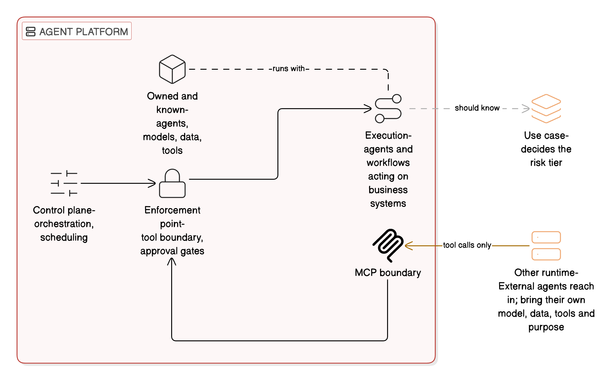
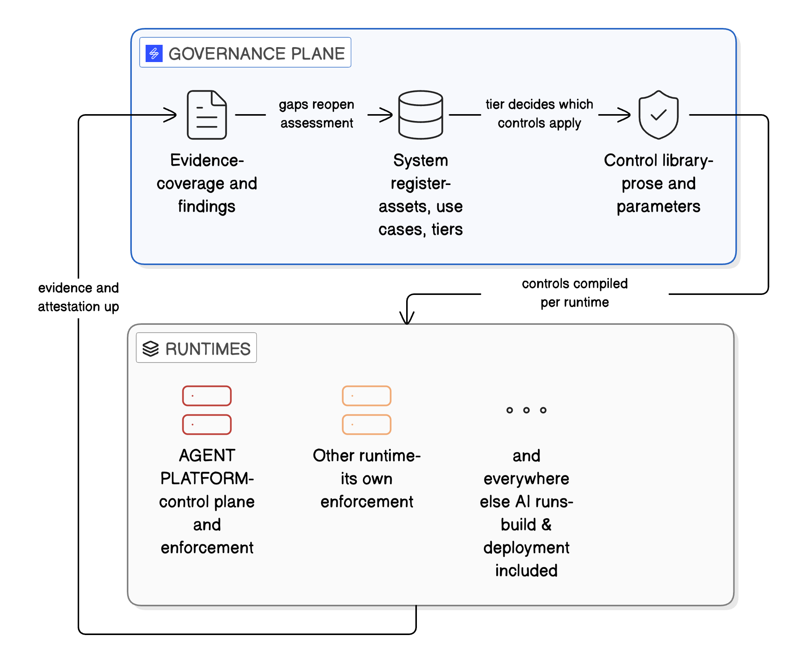
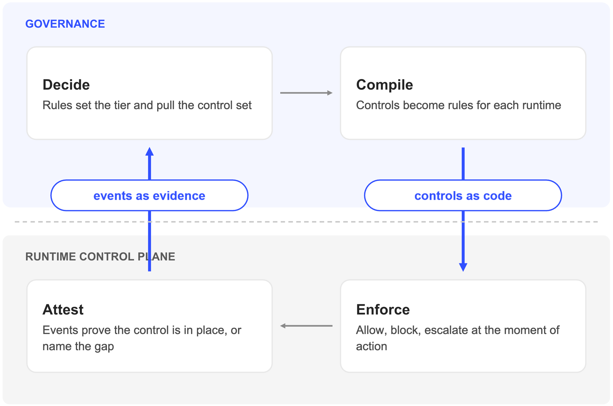

<!-- ainsi: prose size=small caps color=accent -->
Runtime enforcement

# The systems being governed are in flux

<!-- ainsi: boxes stretch -->
1. **Models** Swapped for a newer version, a cheaper provider or a fine-tune, and every system built on the old one inherits the change.
2. **Agents and the platforms they run on** Built on Foundry, Bedrock, Vertex or in-house orchestration, reaching into business systems through tools, replaced in weeks.
3. **AI inside the tools already in use** Copilots in productivity suites, assistants inside SaaS, GenAI in the delivery pipeline. Adopted faster than any review cycle, often without anyone registering them.

<!-- ainsi: prose size=small color=soft -->
A bank's AI estate changes weekly. Governance that was designed around a quarterly model review meets a fleet it cannot see.

---

<!-- ainsi:layout split side=right size=image -->

# A control plane governs what it runs

Each runtime enforces at its own boundary: tool calls, approval gates, content filters. That enforcement is real, and it stops at the platform edge.

The platform knows who runs a workflow and who approved a change. It does not carry the system's purpose, its risk tier or the person answerable for it. Risk is contextual, so the tier is decided where the use case is, not where the code runs.

An agent arriving over an open interface brings its own model, data, tools and purpose. The host enforces at the tool boundary. Governance has to see all the systems.

<!-- ainsi: full size=full -->

---

<!-- ainsi:layout split side=right size=image -->

# Two layers, one loop

Governance decides: the tier, the control set, the owner, the evidence required. It has to cover every runtime, including those with no enforcement of their own.

Enforcement applies the decision at the moment of action: allow, block, escalate. It lives in each runtime and must be fast.

Controls are authored once, with prose for the person and parameters for the machine, then compiled per runtime. Saidot enables enforcement. It does not sit in the hot path.

<!-- ainsi: full size=full -->

---

<!-- ainsi:layout split size=image -->

# Evidence comes back from production

Runtime observability events are ingested from the AI stack: Azure AI Foundry, Amazon Bedrock, or any runtime over the API. An event can open an incident, trigger a review or change the risk level on an agent, a model or a system.

Evidence attaches to the control on the system's record, with the classification, the approvals and the audit trail beside it. Reused across systems, exported on demand, and traceable from the obligation to the event that proved it.

A runtime that cannot check a control returns that as a named gap. Never a silent pass.

<!-- ainsi: full size=full -->

---

<!-- ainsi:layout default tone=soft -->

# Governance stays a gate. It stops being a queue.

<!-- ainsi: columns -->
1. **Workflows** Rules do the routine. AI Act classification runs on registration and on change. Risks, risk levels and controls are inherited through the graph to every system whose properties match. Lifecycle stages gate on approval.
2. **Tasks** The human process, modelled. Reviews, sign-offs and conformity assessments are raised for the role that owns them, when they are due. Accountability becomes named work, not a policy document.
3. **Agents** Governance, Library and Docs MCP servers put the platform in front of any AI assistant. An agent registers the system from the deployment it sees, drafts the assessment, attaches evidence and opens the approval. 95% of the platform is operable over the REST API.

<!-- ainsi: prose size=small color=soft -->
The same three doors are how a delivery organisation embeds governance into client engagements without adding a manual step to each one.

---

<!-- ainsi:layout default tone=accent -->

# Status and roadmap

<!-- ainsi: boxes stretch -->
- **Shipped** Observability API, Q2 2026. Governance, Library and Docs MCP servers. Full REST API, including control catalogue read and write. Connectors for Azure AI Foundry and Amazon Bedrock. Evaluations generated per system and run in the runtime.
- **In development** Tasks by role. Orchestrator MCP. Lifecycles, roles, thresholds and templates per organisation.
- **Policy as code, roadmap** Controls compiled to each runtime's own policy engine. Applicability rules per system. OSCAL import and export, so a client's existing control catalogue enters the graph as controls, not as a document.

<!-- ainsi: prose size=small color=soft -->
One register, one control library, one risk model. Each runtime keeps enforcing its own.
